# Privara

**One-time recipient addresses for sBTC payments on Stacks.**

Privara lets someone send sBTC to a recipient's normal Stacks identity while settling
the payment to a fresh one-time address controlled by that recipient. The recipient's
long-term wallet is therefore not exposed as the onchain settlement destination.

[Open the app](https://privara-sbtc.vercel.app/) ·
[Read the user guide](https://privara-sbtc.vercel.app/guide) ·
[Install the SDK](https://www.npmjs.com/package/@privara-stacks/sdk) ·
[Read the protocol specification](docs/m2-stealth-spec.md)

> **Mainnet status:** the contracts, web application, relayer, and SDK are live.
> Small-value real-sBTC end-to-end acceptance and independent security review remain
> required before Privara should be treated as production-ready for meaningful value.

## What Privara Does

A sender only needs the recipient's normal Stacks address. Privara checks whether that
address has registered public privacy keys, derives a fresh settlement address in the
sender's browser, and prepares an exact payment for wallet approval.

For recipients, Privara provides:

- a separate privacy identity generated locally in the browser;
- an encrypted recovery file that must be exported and restore-verified before use;
- local scanning for payments sent to derived one-time addresses;
- sponsored spending when a one-time address holds sBTC but no STX;
- the option to pay another address directly or withdraw to a chosen wallet.

For senders and treasury operators, Privara provides:

- immediate validation that every recipient has registered Privara keys;
- a choice to add the settlement fee on top or include it in the entered amount;
- automatic calculation of any router-funding shortfall;
- SIP-018 signatures binding the exact recipient, amount, fee, nonce, expiry, and router;
- individual private settlements for DAO and contributor payouts.

## A Simple Payment Scenario

Alice wants Bob to receive `0.01 sBTC` without using Bob's everyday wallet as the
settlement destination.

1. Bob creates a Privara privacy identity, downloads its encrypted JSON backup,
   successfully restores it, and registers only the public `P/V` keys.
2. Alice enters Bob's normal Stacks address and `0.01 sBTC` in Privara.
3. Privara verifies Bob's registration and derives a new one-time address locally.
4. Alice chooses **Add fee on top**. At the current 1% settlement rate, Bob receives
   exactly `0.01 sBTC`, the settlement fee is `0.0001 sBTC`, and Alice authorizes
   `0.0101 sBTC` in total.
5. If Alice's Privara router balance is short, the app asks for one wallet approval to
   fund only the difference. There is no separate deposit workflow to manage.
6. Alice reviews the final numbers and signs the exact SIP-018 intent. The relayer
   submits it, and the router settles Bob's amount to the fresh address.
7. Bob unlocks his verified privacy identity and scans. His browser recognizes the
   public announcement and derives the one-time spending key locally.
8. Bob can later pay someone directly from that one-time balance or withdraw it. For a
   sponsored spend, Privara shows and freezes the exact sBTC service fee before Bob
   signs; the sponsor pays the Stacks network fee in STX.

```mermaid
flowchart LR
    A["Alice enters Bob's normal address"] --> B["Privara reads Bob's public P/V keys"]
    B --> C["Alice's browser derives a fresh one-time address"]
    C --> D["Alice reviews amount, fee, and funding shortfall"]
    D --> E["Alice signs the exact SIP-018 intent"]
    E --> F["Relayer submits settlement to the router"]
    F --> G["Fresh address receives Bob's sBTC"]
    F --> H["Encrypted announcement is emitted onchain"]
    H --> I["Bob scans locally with his privacy identity"]
    I --> G
    G --> J["Bob pays another address or withdraws"]
```



The diagram illustrates address flow, not hidden transaction activity. The asset,
amount, timing, payer interaction, relayer activity, one-time address, and later spends
remain public or observable.

## How It Works

### 1. Recipient setup

Privara creates an independent 32-byte privacy seed in the recipient's browser. It
derives separate spending and viewing keys, `p` and `v`, and their public keys, `P` and
`V`. Only `P` and `V` are registered onchain.

Registration remains disabled until the encrypted backup has been downloaded and the
same backup has been successfully restored. Importing a different identity cannot
silently overwrite an existing one.

### 2. Private settlement

For each payment, the sender's browser generates a fresh ephemeral key and combines it
with the recipient's registered public keys to derive a one-time Stacks principal. The
sender signs a router-bound SIP-018 intent with a random unordered nonce and expiry.

The relayer submits the intent. The router recovers the signer, enforces the asset,
amount, fee, expiry, and replay rules, transfers sBTC, and emits the encrypted
announcement used for recipient discovery.

### 3. Recipient discovery and spending

The recipient scans public announcements. Invalid records are skipped individually, so
one malformed announcement cannot stop the remaining scan. Matching and one-time-key
derivation happen locally from the privacy identity.

When the recipient spends, the browser first fetches the exact sponsor quote. The
displayed destination, payment amount, fee recipient, token fee, asset, and expected
sponsor are frozen into the origin-signed transaction. The relayer rejects any mismatch
instead of silently refreshing the quote.

## Fees

| Fee | Paid by | Current mainnet policy | Purpose |
| --- | --- | --- | --- |
| Settlement fee | Sender | 1% | Relayer-assisted private settlement |
| Sponsored-spend service fee | Recipient | 1,200 sats | Compensates Privara when the sponsor pays the network fee in STX |

The sender can choose:

- **Add fee on top:** the recipient gets exactly the entered amount.
- **Include fee in amount:** the settlement fee is deducted from the entered total.

The sponsored-spend fee is fetched before confirmation, displayed exactly, and signed
with the spend. A full withdrawal sends the available balance minus that approved fee.

## Privacy and Wallet Safety

Privara's guarantee is specific: **the recipient's long-term wallet is not the onchain
settlement destination.**

Privara does not claim to hide payment amounts, payer activity, transaction timing,
relayer or network metadata, or links created by later spending and withdrawal.

Stealth balances are controlled by the independent Privara privacy seed—not by Leather,
Xverse, or a connected hardware wallet. Those wallets cannot recover the privacy seed
or its one-time balances.

Recommended wallet hygiene:

- keep the encrypted Privara backup and its password in separate secure locations;
- never share the privacy seed, `p`, `v`, a one-time private key, or backup password;
- use a new one-time destination for every incoming private payment;
- avoid immediately consolidating every one-time balance into the same known wallet;
- pay a merchant or recipient directly from a one-time balance when appropriate;
- treat distinctive amounts and immediate withdrawals as potentially linkable.

## Frequently Asked Questions

### Does Bob need to give Alice a special Privara address?

No. Alice enters Bob's normal Stacks address. Privara reads Bob's registered public
privacy keys and derives a fresh one-time destination automatically.

### Do I have to deposit before making a payment?

There is no separate deposit workflow in the current interface. The router can only
settle tokens transferred to it by the sender, so Privara checks the existing router
balance and requests one wallet approval only for the exact shortfall.

### Is the payment amount private?

No. The amount, token, timing, settlement address, and transaction activity remain
visible onchain. Privara protects the recipient's long-term wallet from appearing as the
settlement destination.

### Who controls funds at a one-time address?

The recipient's independent Privara privacy seed derives its spending key. The connected
Leather, Xverse, or hardware wallet does not control or recover those funds.

### Why must I verify the backup before registering?

Once public `P/V` keys are registered, payments can be sent to addresses controlled by
that privacy identity. Restore verification proves that the recipient can recover the
same identity before it is used to receive funds.

### Can importing a backup replace my existing identity?

Not silently. Privara compares the imported public identity with any existing identity
and stops on a mismatch. An unrelated backup cannot appear to recover registered funds.

### Does scanning expose my privacy seed?

No. The scanner reads public announcements, while ownership checks and spending-key
derivation happen locally. Private key material is not sent to the relayer or indexer.

### Can a one-time address be reused?

It remains a valid address, but Privara derives a fresh destination for every payment.
Deliberate reuse weakens privacy and is not the intended workflow.

### Can the recipient pay someone else instead of withdrawing?

Yes. The recipient can send an amount supported by the selected one-time balance to
another valid address. Privara never combines separate one-time balances automatically.

### Who pays the network fee?

For a sponsored spend, Privara's sponsor pays the Stacks fee in STX and the recipient
approves the displayed service fee in sBTC. The original payment's settlement fee is
paid by the sender, either on top of or inside the entered amount.

### Can the sponsor change the fee after I approve it?

No. The approved quote is pinned. If the destination, amount, asset, fee recipient,
sponsor, or fee changes, submission fails and the user must review a new quote.

### Is Privara audited and ready for large mainnet payments?

Not yet. Automated regression coverage and the mainnet infrastructure are live, but
real-sBTC acceptance evidence and an attributable independent review remain open gates.
Use only small amounts while validation continues.

## Live Mainnet Deployment

| Component | Address or URL |
| --- | --- |
| Application | [privara-sbtc.vercel.app](https://privara-sbtc.vercel.app/) |
| Relayer health | [privara-production.up.railway.app/health](https://privara-production.up.railway.app/health) |
| Relayer configuration | [privara-production.up.railway.app/v1/config](https://privara-production.up.railway.app/v1/config) |
| Deployer | `SP1H7G0B7BBM991P2KA77R0XHDRNYCWH8H808K7AE` |
| Stealth registry | `SP1H7G0B7BBM991P2KA77R0XHDRNYCWH8H808K7AE.privara-stealth-registry` |
| sBTC router | `SP1H7G0B7BBM991P2KA77R0XHDRNYCWH8H808K7AE.privara-router-m2-sbtc` |
| Sponsored-spend helper | `SP1H7G0B7BBM991P2KA77R0XHDRNYCWH8H808K7AE.privara-sponsored-spend-v2` |
| Official sBTC | `SM3VDXK3WZZSA84XXFKAFAF15NNZX32CTSG82JFQ4.sbtc-token` |
| Relayer | `SP25K47CGNDNT2KYNS1WB10ZFFRQBY0KDSV11PNW9` |
| Sponsor and fee recipient | `SP2EN3FBV0VY4SMYH0JXE3N6QE9ASAHGD2YNJRMXX` |

Deployment transaction IDs and acceptance gates are in the
[mainnet deployment record](docs/mainnet-deployment.md).

## Architecture

| Layer | Responsibility |
| --- | --- |
| React application | Wallet connection, backup UX, local derivation, scanning, payment review, and DAO payout orchestration |
| TypeScript SDK | SIP-018 intents, unordered nonces, stealth cryptography, backups, scanning, funding calculations, and sponsored transactions |
| Relayer service | Public configuration, validation, broadcasting, sponsorship, CORS policy, and durable duplicate protection |
| Stealth registry | Maps normal Stacks principals to public spending and viewing keys |
| sBTC router | Holds sender-authorized deposits, verifies intents, settles sBTC, and emits announcements |
| Sponsored-spend helper | Executes the exact origin-signed payment and service fee while the sponsor pays STX |

The router is custodial for deposited sBTC until settlement or withdrawal. Funds at a
derived one-time address are self-custodial under the recipient's privacy seed. See the
[architecture guide](docs/architecture.md) and
[security threat model](docs/security-threat-model.md) for full trust boundaries.

## SDK

The reusable TypeScript SDK is published as `@privara-stacks/sdk`.

```bash
npm install @privara-stacks/sdk
```

See the [developer guide](docs/developer-guide.md) for integration details.

## Run Locally

Requirements: Node.js 22 or later, npm, and
[Clarinet](https://github.com/hirosystems/clarinet).

```bash
npm install
npm test
clarinet check
npm run app:dev
```

The React app starts at `http://localhost:5173`. Configure its relayer through `app/.env`;
start from [app/.env.example](app/.env.example) for development or
[app/.env.mainnet.example](app/.env.mainnet.example) for mainnet.

Run the relayer locally with:

```bash
npm run relayer:serve
```

Never commit private keys, mnemonics, privacy seeds, backup passwords, sponsor keys, or
production environment files.

## Validation

The current repository passes **146 automated tests across 21 test files**. Coverage
includes SIP-018 digest parity, replay handling, sponsor-quote binding,
backup-before-registration, safe import, malformed-announcement resilience,
fresh-session recovery, router funding, relayer validation, durable duplicate handling,
and sponsored spending.

Browser-wallet approval, real-sBTC mainnet acceptance, independent reproduction, and
external security review require separate live evidence and are not implied by the test
count.

## Repository Layout

```text
app/         Standalone Vite + React application
contracts/   Clarity contracts and SIP-010 trait
docs/        Protocol, security, deployment, operations, and reproduction guides
relayer/     Reference HTTP relayer and sponsor service
scripts/     Deployment, acceptance, scanning, and operational scripts
sdk/         Published TypeScript SDK
tests/       Contract, SDK, application-library, and relayer regression tests
```

## Documentation

Start with the [documentation index](docs/README.md). Important references:

- [M2 stealth settlement specification](docs/m2-stealth-spec.md)
- [Privacy model](docs/privacy-model.md)
- [Sponsorship and fee model](docs/sponsorship.md)
- [Security threat model](docs/security-threat-model.md)
- [Relayer API](docs/relayer-api.md)
- [Mainnet deployment record](docs/mainnet-deployment.md)
- [Independent reproduction guide](docs/reproducibility.md)

Privara is authored by **Samuel Dahunsi** under the **Privara** organization.
